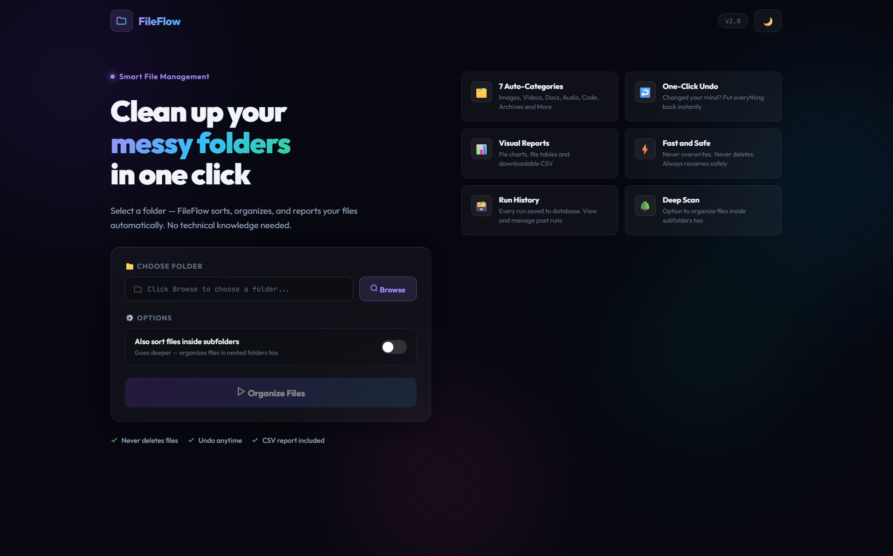
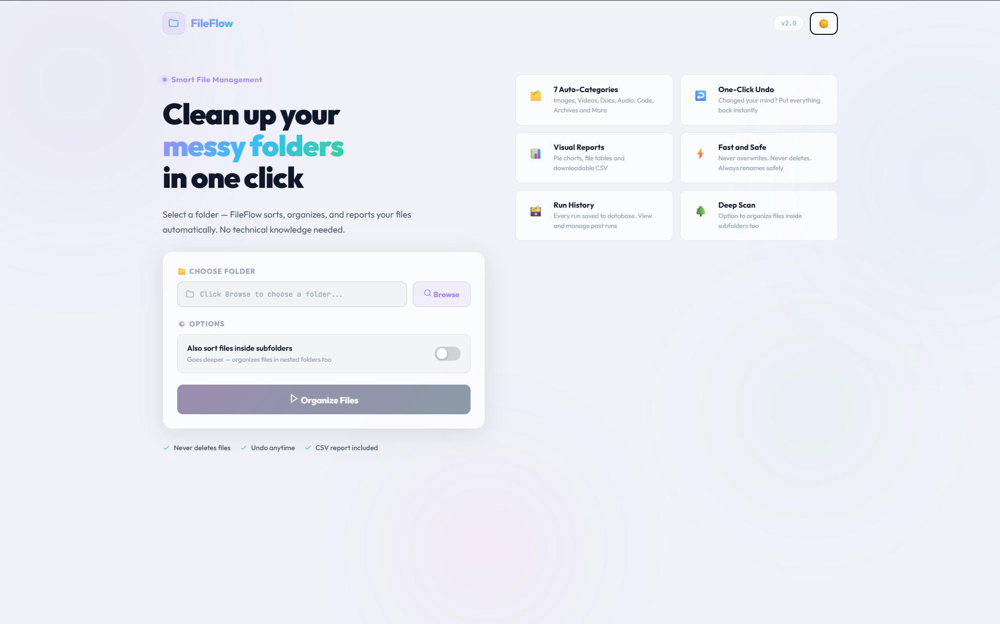
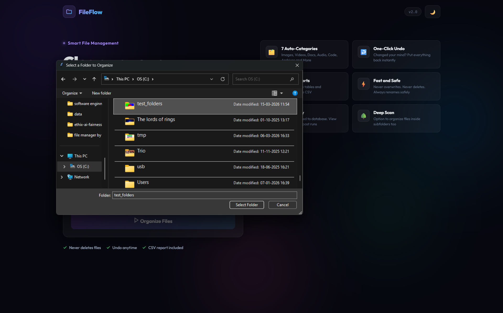
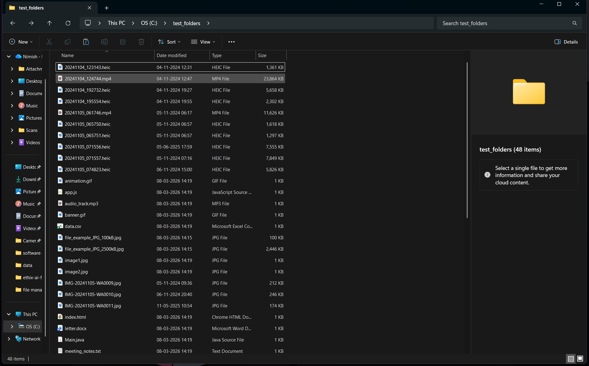
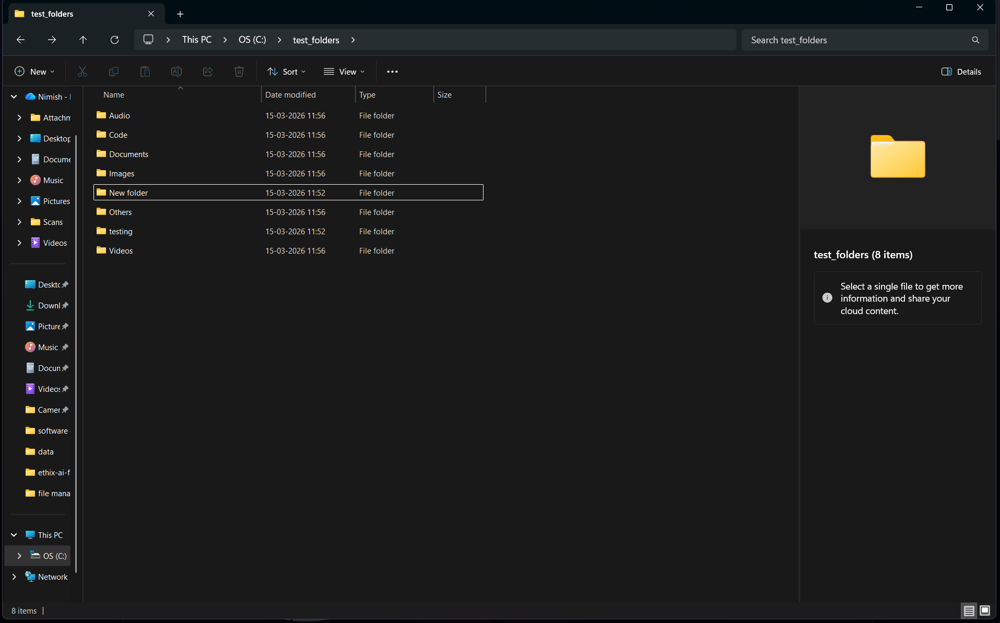
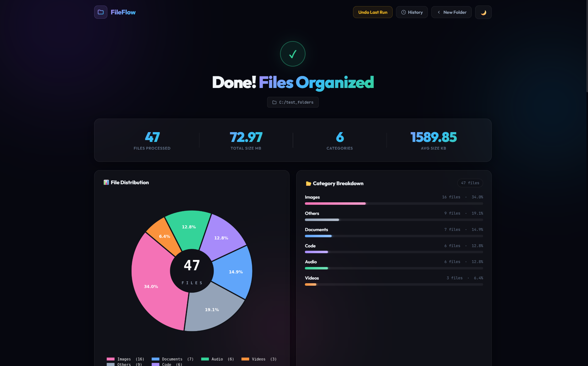
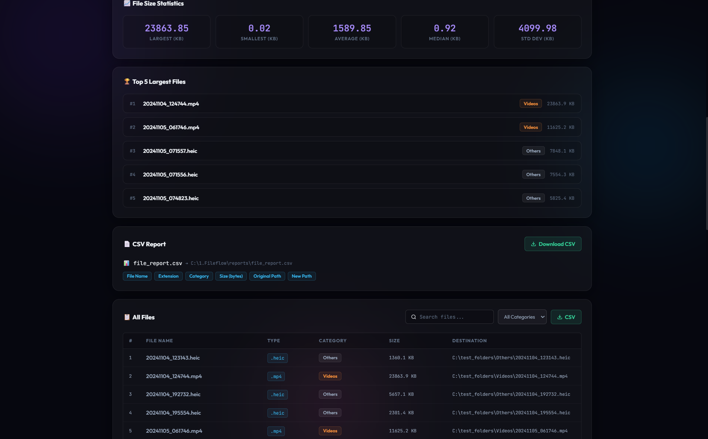
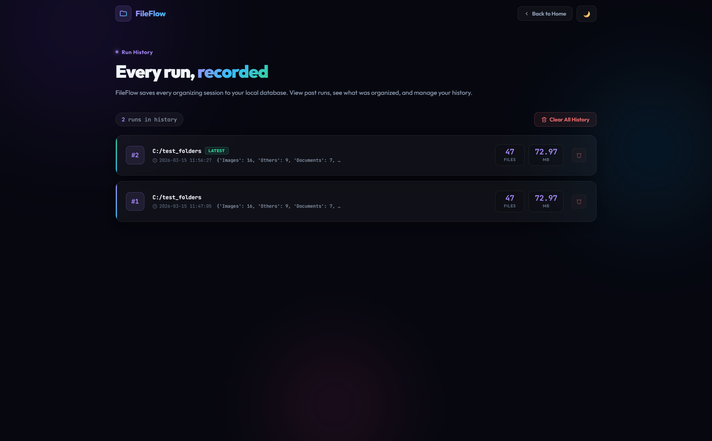

# FileFlow — Smart File Organizer

> A full-stack Python web application that automatically organizes messy folders — sorting files into categories, generating reports, and saving every run to a database.


---

## What It Does

Select any folder → FileFlow scans every file, classifies it by extension, moves it into the right category subfolder, generates a CSV report with Pandas, draws a pie chart with Matplotlib, and saves the run to SQLite — all in one click.

---

## Features

| Feature | Details |
|---|---|
| **7 Auto-Categories** | Images, Videos, Documents, Audio, Code, Archives, Others |
| **One-Click Undo** | Every move is logged — click Undo to restore all files to original locations |
| **Deep Scan Toggle** | Organizes files inside subfolders — each subfolder gets its own category folders |
| **Visual Reports** | Matplotlib donut chart, animated category bars, NumPy statistics panel |
| **CSV Download** | Full Pandas DataFrame exported with original path, new path, size, category |
| **Run History** | SQLite records every session — folder, file count, size, timestamp |
| **Dark / Light Mode** | CSS variable theming with localStorage — toggles instantly |
| **Fully Responsive** | Works on mobile and desktop without any CSS framework |
| **Collision-Safe** | Duplicate filenames renamed automatically — photo.jpg → photo_1.jpg |

---

## Tech Stack

| Technology | Role |
|---|---|
| **Python + Flask** | Backend web server, routing, session management, tkinter folder picker |
| **Pandas** | DataFrame operations, CSV export, category counting, groupby statistics |
| **NumPy** | File size statistics — max, min, mean, median, standard deviation |
| **Matplotlib** | Donut chart via Agg backend → base64 PNG → embedded in HTML |
| **SQLite3** | Built-in run history database — no server needed |
| **HTML / CSS / JS** | Glassmorphism UI, dark/light themes, Fetch API, Jinja2 templates |

---

## Installation

**Prerequisites:** Python 3.10+

```bash
# 1. Clone the repo
git clone https://github.com/your-username/fileflow.git
cd fileflow

# 2. Install dependencies
pip install flask pandas numpy matplotlib

# 3. Run
python app.py

# 4. Open in browser
# http://127.0.0.1:5000
```

---

## Project Structure

```
smart-file-organizer-web/
├── app.py                     # Flask routes, session, tkinter browse
├── organizer/
│   ├── config.py              # FILE_CATEGORIES dict + CATEGORY_COLORS
│   ├── scanner.py             # scan_directory() — shallow + rglob deep scan
│   ├── classifier.py          # classify_file() + classify_all()
│   ├── mover.py               # move_files() + undo_last_run() + undo log
│   └── report/
│       ├── csv_report.py      # Pandas DataFrame → CSV
│       ├── chart.py           # Matplotlib donut chart → base64 PNG
│       ├── stats.py           # Pandas + NumPy statistics
│       └── database.py        # SQLite run history
├── templates/
│   ├── index.html             # Homepage
│   ├── result.html            # Results dashboard
│   └── history.html           # Run history
└── static/
    ├── style.css              # Dark/light themes, glassmorphism, responsive
    └── script.js              # Fetch API, theme toggle, bar animations
```

---

## How It Works

1. User opens `http://127.0.0.1:5000`
2. Clicks **Browse** — native OS folder picker opens via `tkinter`
3. Optionally toggles **"Also sort files inside subfolders"** for deep scan
4. Clicks **Organize Files** — JavaScript sends `POST /organize` to Flask
5. Flask calls `scanner.py → classifier.py → mover.py` in sequence
6. `report/` package generates CSV, donut chart, and NumPy statistics
7. Stats written to disk — bypasses Flask's 4 KB cookie session limit
8. Browser redirects to `/result` — Jinja2 renders the full dashboard
9. Every run saved to SQLite — viewable on `/history`
10. **Undo** reads `undo_log.json` and moves every file back to its original location

---

## File Categories

| Category | Extensions |
|---|---|
| Images | `.jpg` `.jpeg` `.png` `.gif` `.bmp` `.svg` `.webp` `.tiff` |
| Videos | `.mp4` `.mkv` `.avi` `.mov` `.wmv` `.flv` `.webm` |
| Documents | `.pdf` `.txt` `.docx` `.doc` `.xlsx` `.xls` `.pptx` `.ppt` `.odt` |
| Audio | `.mp3` `.wav` `.aac` `.flac` `.ogg` `.m4a` `.wma` |
| Code | `.py` `.java` `.js` `.cpp` `.c` `.h` `.css` `.html` `.ts` `.go` `.rb` `.php` |
| Archives | `.zip` `.rar` `.tar` `.gz` `.7z` `.bz2` |
| Others | Everything else |

---

## Key Technical Decisions

**Session storage on disk** — Flask's default session uses a browser cookie (4 KB limit). The base64 chart alone is ~100 KB. Stats are written to `flask_sessions/*.json` on disk and only a 36-byte UUID key is stored in the cookie.

**NumPy type conversion** — NumPy returns `numpy.int64` / `numpy.float64` types that are not JSON serialisable. Every NumPy result is wrapped in `float()` or `int()` before storage.

**Matplotlib Agg backend** — Servers have no display. `matplotlib.use("Agg")` is called before importing `pyplot`. The chart renders into a `BytesIO` buffer, encodes to base64, and embeds directly in the HTML `` tag — no file saved to disk.

**Subfolder organisation** — When deep scan is enabled, each subfolder gets its own category folders created *inside* it. Files never cross folder boundaries. The undo log stores full original paths so undo works correctly for nested files.

---

## What I Learned Building This

- Flask routing, Jinja2 templating, and session management from scratch
- How browsers communicate with a backend using the Fetch API and JSON
- Why Flask's cookie session has a 4 KB limit and how to work around it
- Pandas DataFrames for structured data — `groupby`, `value_counts`, `to_dict`
- NumPy statistical operations and why type conversion matters
- Matplotlib server-side rendering and base64 image embedding
- SQLite3 — parameterised queries, connection management, `?` placeholders
- CSS custom properties for instant dark/light theme switching
- Responsive layout with CSS Grid and Flexbox — no framework
- Python package structure — `__init__.py`, relative imports, `__all__`

---
| Dashboard | Light Theme |
|---|---|
|  |  |

| Folder Selection | Processing |
|---|---|
|  |  |

| Organized Folder | Results |
|---|---|
|  |  |

| File Overview | History |
|---|---|
|  |  |
---

## Known Limitations

- Undo only supports the most recent run
- `flask_sessions/` folder accumulates JSON files and is not auto-cleaned
- No user authentication — single shared history

---

*FileFlow v2.0 · Python Full-Stack Portfolio Project*
